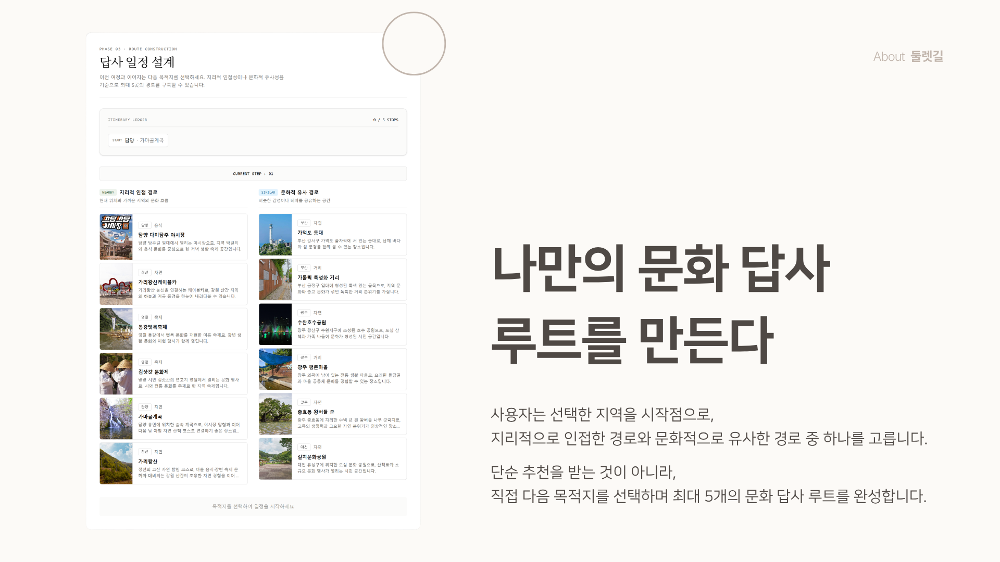

<div align="center">
  
</div>

# 둘렛길

> khuthon 2026 최우수상 수상작 🏆
### 둘 중 하나를 고르며, 숨은 지역 문화를 길로 잇다

둘렛길은 두 지역 중 하나를 고르는 1대1 선택 구조에서 시작해,  
사용자가 숨은 지역 문화를 직접 연결하고 기록하는 문화 답사 루트 플랫폼입니다.

## 문제의식

문화 콘텐츠는 많아졌지만, 모든 문화가 공정하게 발견되지는 않습니다.

대도시와 인기 콘텐츠는 반복적으로 노출되는 반면,  
소도시·전통문화·로컬 문화는 사용자에게 도달하기 어렵습니다.

둘렛길은 숏폼이나 밸런스게임처럼 익숙한 빠른 선택 구조를 피하지 않고,  
오히려 이를 소외된 지역 문화가 발견되는 입구로 재설계했습니다.

## 핵심 아이디어

- **승패보다 발견**  
  선택 결과를 인기 경쟁이 아니라 답사의 출발점으로 사용합니다.

- **인기보다 다양성**  
  동일 규모 매칭과 다양성 가중치로 저노출 지역이 발견될 기회를 만듭니다.

- **추천보다 연결**  
  사용자가 근처 지역 또는 유사 취향 기준으로 직접 루트를 생성합니다.

- **기록 기반 확장**  
  탐험 결과를 개인 기록장과 취향 분석으로 축적합니다.

## 주요 기능

- 지역 문화 1대1 선택
- 매칭 이유 및 다양성 보정 설명
- 근처 지역 / 유사 취향 기반 루트 설계
- 최대 5개 문화 답사 경로 생성
- 지역 메모 확인
- 탐험 완료 기록 저장
- 발견 지역, 최근 루트, 문화 취향 분석 대시보드

## 기술 스택

- Next.js 14
- TypeScript
- Tailwind CSS
- 한국관광공사 TourAPI 기반 데이터 수집·정제
- 정적 데이터 기반 MVP

## 데이터 구조

시연 안정성을 위해 TourAPI를 실시간 호출하지 않고,  
수집·정제한 데이터를 정적 데이터로 변환해 사용했습니다.

- 동일 규모 지역 매칭
- CultureTag 기반 태그 분류
- diversityWeight 기반 다양성 보정
- 실제 지역 이미지 URL 반영

## 실행 방법

```bash
npm install
npm run dev
```

브라우저에서 아래 주소로 접속합니다.

```bash
http://localhost:3000
```

## 발표 자료

발표 PDF는 별도 파일로 포함되어 있습니다.

- `Khuthon_둘렛길.pdf`

## 만든 사람

- 최고의 공룡 스피노사우루스 - 고도영
- KHUTHON 2026